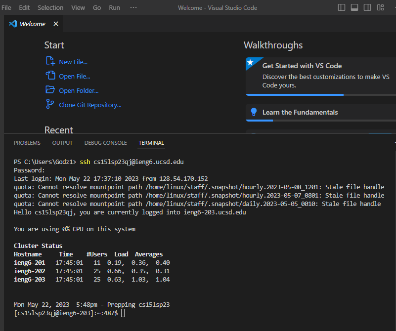
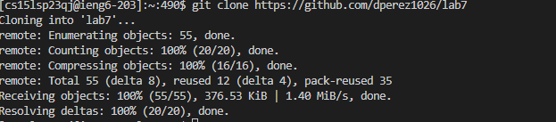
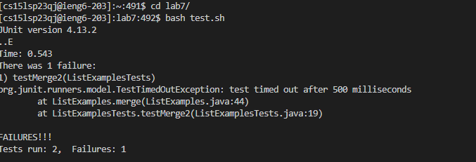
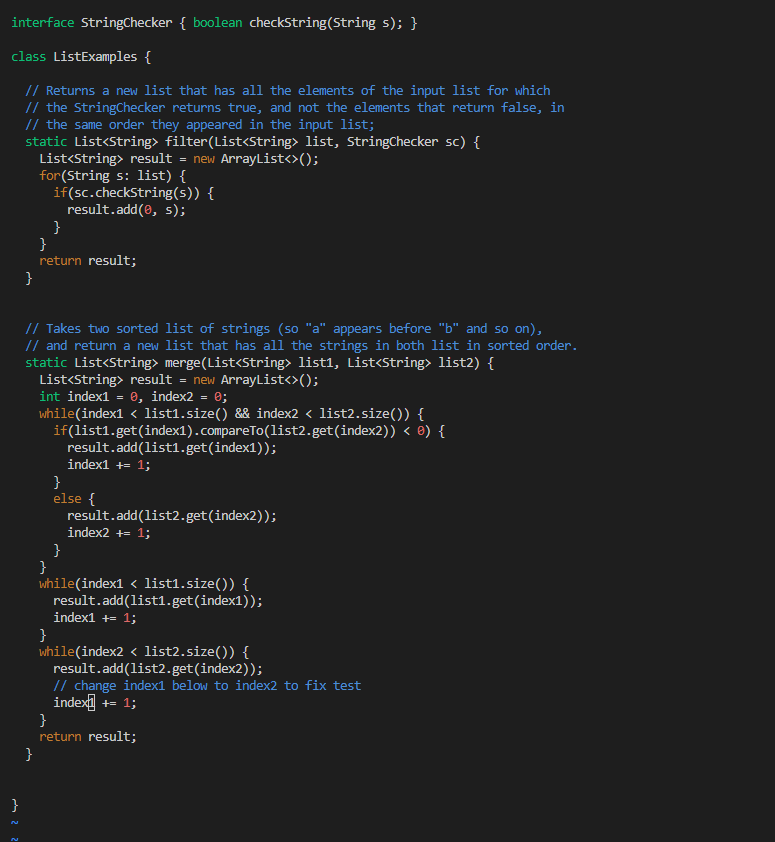
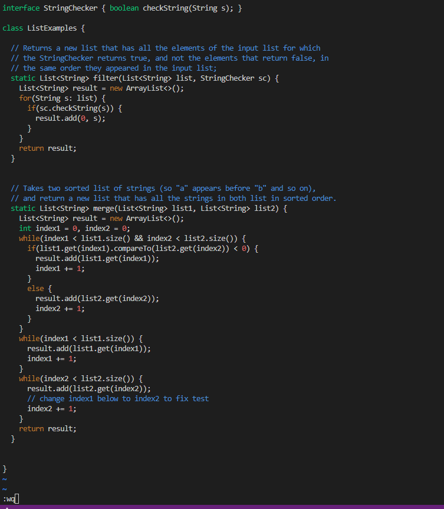
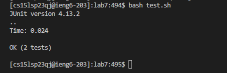
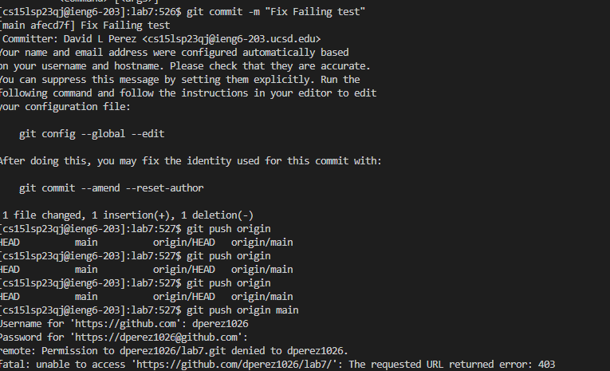

# vim command line use  
**step one**  
  
First, I typed `ssh cs15lsp23qj@ieng6.ucsd.edu` which logs you into your course specific account depending on username, then `<enter>` and when prompted entered my password `______` then pressed `<enter>` again. Another faster way to do this without entering a password is to use `SSH` keys. First, generate a key using `ssh-keygen -t rsa -b 4096` with `4096` being any random high number, then press `<enter>`, `<enter>`, and `<enter>` again to enter the command, accept the default file location, and finally making sure it has no password by pressing `<enter>` the third and last time while the passphrase prompt is empty. Next, copy the public key to the remote server using `ssh-copy-id username@remote_server`, then hitting `<enter>`, and using `ssh cs15lsp23qj@ieng6.ucsd.edu` then `<enter>` again to log in without a password once set up.  
**step two**  
  
Next, I copy and pasted `git clone https://github.com/dperez1026/lab7` which adds a forked repository and clones it into my course specific account using `<ctrl+v>`, then  `<enter>`.   
**step three**   
   
 
After, I changed the directory into lab7 by typing `cd lab7/`, then `<enter>` and ran the test proving it fails using `bash test.sh` and pressing `<enter>` once more.  

Next, I typed `vim ListExamples.java` and `<enter>` which displayed the code in the fail, while in `vim`, I pressed `/index1` and `<enter>` and pressed the `shift + n` key which naviages the previous search of `index1`, and ends up at the correct form of `index1` that needs to be changed to `index2` in order for the tests to pass.  
**step four**  
   
To change the value, I then pressed `<right>,<right>,<right>,<right>,<right>` which put me on the number 1, then I pressed `x` which deletes the number, `i` which changes you into editing mode, and then finally pressing `2` and `<enter>` which enters that number value and replaces the incorrect value with the new correct one. Then, simply press `<esc>` to exit the editing mode, and enter `:wq` then press `<enter>` to save the changes and exit `vim`.  
 **step five**
 
   
 Then, I retyped `bash test.sh` and `<enter>` to show that the tests ran and worked after the fix.  
 
 **step six**  

  
Finally, I typed `git add ListExamples.java` and `<enter>` then `git commit -m "Fix Failing test"` and `<enter>`, which commits the git file to the repository, after that I typed `git push origin main` which pushed the commit back. 

  **step seven**  

  

